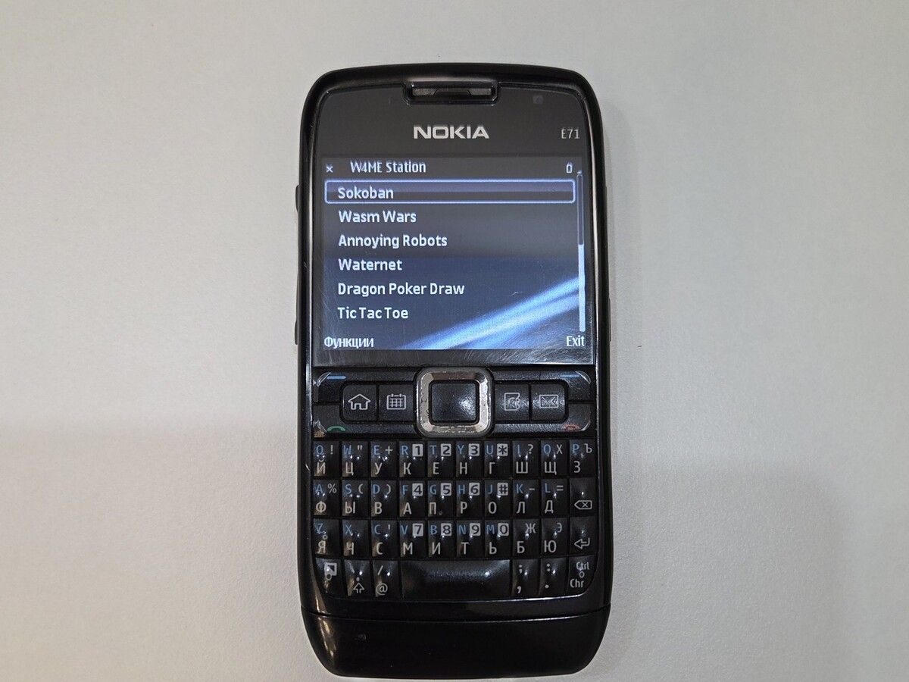
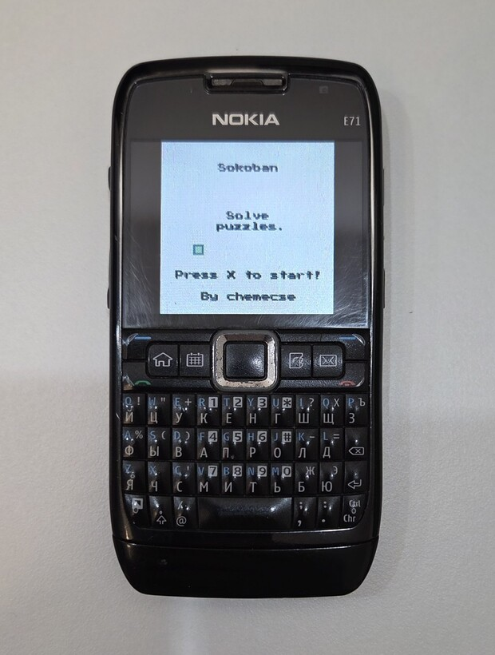
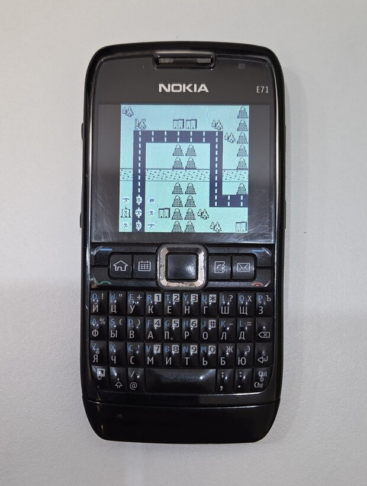
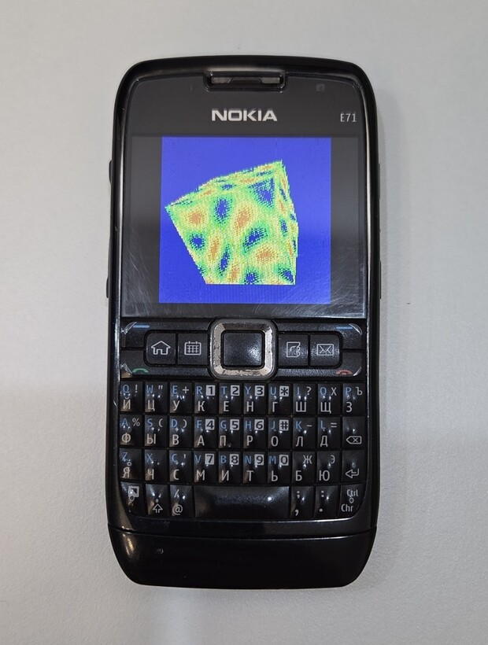

# W4ME Station

A WebAssembly interpreter written for Java 1.3 that runs unmodified
[WASM-4](https://wasm4.org/) cartridges on phones from the mid 2000s.

<p align="center">
  
</p>

Thirteen bundled cartridges ship in a 275 KB JAR. The runtime uses no JIT, and
the bundled library needs no network connection. Both release variants stay
below 300 KB.

## Download

| Variant | Application | Descriptor |
| --- | --- | --- |
| Full, with optional JSR-75 file browsing | [w4me-station.jar](dist/w4me-station.jar?raw=1) | [w4me-station.jad](dist/w4me-station.jad?raw=1) |
| Base, without JSR-75 classes | [w4me-station-base.jar](dist/w4me-station-base.jar?raw=1) | [w4me-station-base.jad](dist/w4me-station-base.jad?raw=1) |

[SHA-256 checksums](dist/SHA256SUMS) are stored beside the version `1.0.0`
artifacts.

W4ME Station targets CLDC 1.1 / MIDP 2.0 devices. It is independent from and not
endorsed by the WASM-4 maintainers.

## Cartridge library

Sokoban, Wasm Wars, Annoying Robots, Waternet, Dragon Poker Draw, Tic Tac Toe,
Watris, Glowfish Chess, Duck Maze, Rubido, Untangle, Sound Demo, and Plasma
Cube. Further `.wasm` files can be installed from the device.

<p align="center">
  
  
  
</p>

## Features

- validated WebAssembly execution with a persistent fixed-width W4IR cache;
- WASM-4 graphics, input, audio, disk, text, and tracing host APIs;
- thirteen bundled cartridges plus HTTP(S), RMS, URL, and optional JSR-75 loading;
- phone keys, keyboard controls, pointer input, and an on-screen touch pad;
- per-cartridge persistent disk storage with checksummed RMS generations;
- sampled MMAPI audio with streamed MIDI, `playTone`, and silent fallbacks;
- global RMS-backed sound On/Off and master-volume controls;
- deterministic host, KEmulator, and optional phoneME verification.

The release version is `1.0.0`. The verified scope and remaining limitations
are documented in [Compatibility](docs/compatibility.md).

## Requirements

Development requires Linux with `just`, Podman, and Distrobox installed. The
project toolchain contains JDK 8, ProGuard, KEmulator, WABT, Rust, Node.js, and
supporting utilities. Version-sensitive components are pinned by the container
definition.

```sh
just setup
just doctor
```

Java sources and classfiles remain pinned to Java 1.3.

## Build

```sh
just build
```

Artifacts are written to `dist/`:

| Artifact | Purpose |
| --- | --- |
| `w4me-station.jar` / `.jad` | full build with optional JSR-75 file browsing |
| `w4me-station-base.jar` / `.jad` | build without JSR-75 classes |

Both variants contain the same thirteen cartridges. The base build works on MIDP
2.0 devices that do not implement the optional FileConnection API.

## Installing on a phone

Download one matching `.jad`/`.jar` pair from the table above and keep both
files in the same directory. Use the full build on devices with JSR-75
FileConnection support; use the base build if the full build is rejected or the
device lacks that optional API.

Open the `.jad` from the phone's application manager or file manager. If the
device does not accept JAD installation, transfer and open the matching `.jar`
directly. Installation details and troubleshooting are covered in
[Installation](docs/installation.md).

## Controls

| Input | Player 1 | Player 2 |
| --- | --- | --- |
| Movement | Arrow or directional phone keys | `E`, `S`, `D`, `F` |
| Button 1 | `X`, Fire, or `5` | `Tab` |
| Button 2 | `Z` or `0` | `Q` |

Touchscreen devices display an on-screen directional pad and action buttons.
The controls stay outside the 160×160 framebuffer whenever the screen is large
enough.

`Sound settings` is available from the cartridge library and the in-game
command menu. It contains Automatic/Compatible audio mode, a hard global
Sound On/Off mute, and master volume when the backend supports it. Confirmed
settings persist across MIDlet restarts.

## Loading cartridges

The launcher includes Sokoban, Wasm Wars, Annoying Robots, Waternet, Dragon
Poker Draw, Tic Tac Toe, Watris, Glowfish Chess, Duck Maze, Rubido, Untangle,
Sound Demo, and Plasma Cube, in that order.

Additional `.wasm` files can be installed from HTTP(S), entered as a `file://`
URL, or selected with the JSR-75 browser on supported devices. Installed
cartridges are copied into RMS and can be relaunched without their original
file or network source.

Cartridges are third-party works. Their authors, upstream sources, hashes, and
licenses are listed in [Third-party notices](THIRD_PARTY_NOTICES.md).

## Verification

```sh
just test
just verify
just run
```

The stable commands are listed by `just --list`. Specialized KEmulator,
phoneME, and profiling commands are described in
[Development](docs/development.md). Generated logs, screenshots, and benchmark
receipts are written under `build/reports/`.

## Documentation

- [Compatibility and limitations](docs/compatibility.md)
- [Installing on a phone](docs/installation.md)
- [1.0.0 release notes](CHANGELOG.md)
- [Development and testing](docs/development.md)
- [Performance methodology](docs/performance.md)
- [Release checklist](docs/releasing.md)
- [OpenSpec changes](openspec/changes/)

## License

W4ME Station source code is available under the [MIT License](LICENSE).
Bundled cartridges retain their own licenses and are not covered by the MIT
License.

The optional local phoneME rig is GPL-2.0-only and is not distributed with the
project. Its modified corresponding source is not public yet, so its binaries
must remain local and ignored. See [Performance](docs/performance.md).
